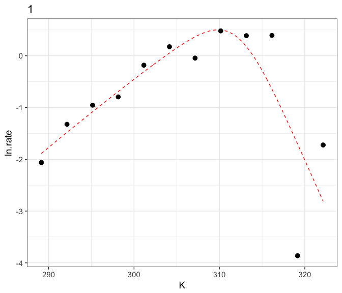

<!-- README.md is generated from README.Rmd. Please edit that file -->
nlsLoop
-------

Tools for expanding the non-linear regression method nls and nlsList from nlme.

### Issues and suggestions

Please report any issues/suggestions in the [issues link](https://github.com/padpadpadpad/nlsLoop/issues) for the repository.

Travis: [](https://travis-ci.org/padpadpadpad/nlsLoop)

### Overview

The mainstay of this package is `nlsLoop::nlsLoop()`. If you have a dataset where you want to fit the same model over many levels of a factor, you may use `nlme::nlsList()`. However, `nlsList()` only allows for one set of starting values so it is possible that not all of the models will converge if the shape of the data, and thus likely parameter values, are very different.

`nlsLoop()` allows for a range of starting values and tries unlimited different starting values to the fit at each level of the factor, picking the best fit for each model using AIC scores.

### Tutorial

A more in-depth tutorial and explanation of how to use `nlsLoop()` can be found as a [blog post](https://padpadpadpad.github.io/post/introducing-nlsloop/) or by calling `vignette('nlsLoop)` from within R.

### Installation and examples

#### 1. Installation

``` r
# install package
devtools::install_github("padpadpadpad/nlsLoop")
```

#### 2. Run nlsLoop()

``` r

# load in nlsLoop
library(nlsLoop)

# load in example data set
data("Chlorella_TRC")

# define the Sharpe-Schoolfield equation
schoolfield_high <- function(lnc, E, Eh, Th, temp, Tc) {
  Tc <- 273.15 + Tc
  k <- 8.62e-5
  boltzmann.term <- lnc + log(exp(E/k*(1/Tc - 1/temp)))
  inactivation.term <- log(1/(1 + exp(Eh/k*(1/Th - 1/temp))))
  return(boltzmann.term + inactivation.term)
  }

# run nlsLoop
fits <- nlsLoop(ln.rate ~ schoolfield_high(lnc, E, Eh, Th, temp = K, Tc = 20),
                     data = Chlorella_TRC,
                     tries = 500,
                     id_col = 'curve_id',
                     param_bds = c(-10, 10, 0.1, 2, 0.5, 5, 285, 330),
                     r2 = 'Y',
                     supp_errors = 'Y',
                     AICc = 'Y',
                     na.action = na.omit,
                     lower = c(lnc = -10, E = 0, Eh = 0, Th = 0))
```

#### 3. Check output

``` r
head(fits$params)
#>   curve_id       lnc         E       Eh       Th      AIC  quasi_r2
#> 1        1 -1.346211 0.9877307 4.332645 312.1887 48.01896 0.4608054
#> 2        2 -1.349431 1.0653450 4.211374 312.6591 22.39398 0.8978426
#> 3        3 -1.815315 1.1155333 4.140395 310.9545 34.77114 0.7804032
#> 4        4 -1.612615 1.0982576 3.025816 310.6412 31.04688 0.8709134
#> 5        5 -1.767711 1.1244277 9.010641 317.0688 41.69970 0.7602547
#> 6        6 -1.717258 1.1727047 4.077252 311.4596 37.03555 0.7289198
```

#### 4. Check fit of single curve

``` r
# plot a single curve
plot_id_nlsLoop(raw_data = Chlorella_TRC, param_data = fits, id = '1')
#> Warning: Removed 750 rows containing missing values (geom_path).
#> Warning: Removed 36 rows containing missing values (geom_point).
```



#### 5. Check fit of all curves (creates a pdf)

``` r
# create pdf of each curve
plot_all_nlsLoop('path/of/where/you/want/to/save/me.pdf', raw_data = Chlorella_TRC, param_data = fits)
```
