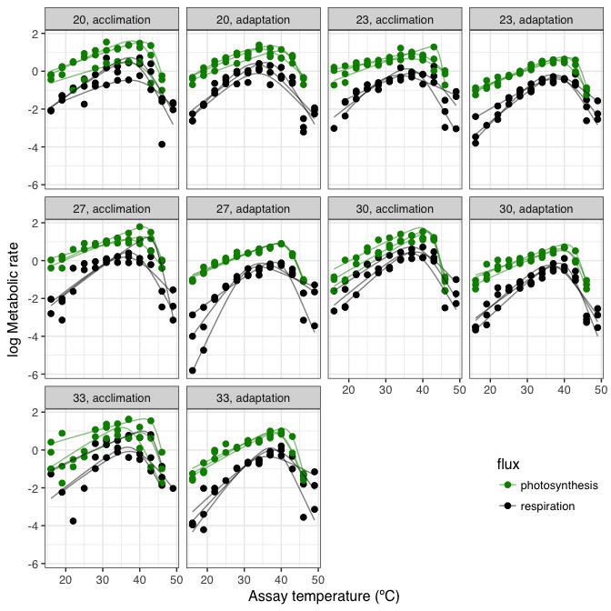
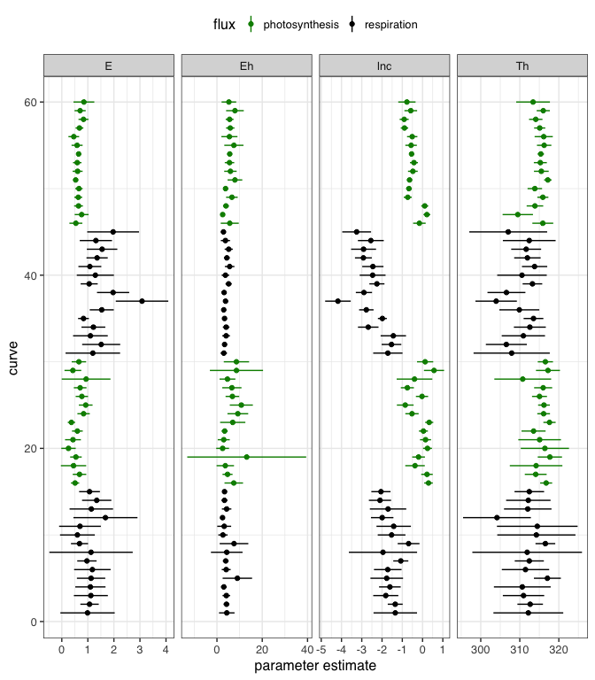

<!-- README.md is generated from README.Rmd. Please edit that file -->
nlsLoop
-------

Tools for expanding the non-linear regression method nls and nlsList from nlme.

### Issues and suggestions

Please report any issues/suggestions for improvement in the [issues link](https://github.com/padpadpadpad/nlsLoop/issues) for the repository. Or please email <d.padfield@exeter.ac.uk>.

Travis: [](https://travis-ci.org/padpadpadpad/nlsLoop)

### Licensing

This package is licensed under GPL-3.

### Overview

The mainstay of this package is `nlsLoop::nlsLoop()`. If you have a dataset where you want to fit the same model over many levels of a factor using non-linear regression, you may use `nlme::nlsList()`. However, `nlsList()` only allows for one set of starting values so it is possible that not all of the models will converge if there is large variance in the data or the shape of the relationships are different, and thus the parameter values, are likely to be very different.

`nlsLoop()` allows for a range of starting values, looping through and attempting a fit for thousands of unique combination of starting values at each level of the factor, picking the best fit for each model using AIC scores.

It also returns predictions for each level of the factor in tidy format, making it simple to plot and evaluate each fit using `ggplot2`.

### Tutorial

A more in-depth tutorial and explanation of how to use `nlsLoop()` can be found by calling `vignette('nlsLoop')` from within R.

### Installation and examples

#### 1. Installation

``` r
# install package
devtools::install_github("padpadpadpad/nlsLoop", build_vignettes = TRUE)
```

#### 2. Run nlsLoop()

``` r

# load in nlsLoop and other packages
library(nlsLoop)
library(ggplot2)

# load nlsLoop vignette
vignette('nlsLoop')

# load in example data set
data("Chlorella_TRC")

# define the Sharpe-Schoolfield equation
schoolfield_high <- function(lnc, E, Eh, Th, temp, Tc) {
  Tc <- 273.15 + Tc
  k <- 8.62e-5
  boltzmann.term <- lnc + log(exp(E/k*(1/Tc - 1/temp)))
  inactivation.term <- log(1/(1 + exp(Eh/k*(1/Th - 1/temp))))
  return(boltzmann.term + inactivation.term)
  }
```

``` r
# run nlsLoop
fits <- nlsLoop(ln.rate ~ schoolfield_high(lnc, E, Eh, Th, temp = K, Tc = 20),
                     data = Chlorella_TRC,
                     tries = 500,
                     id_col = 'curve_id',
                     param_bds = c(-10, 10, 0.1, 2, 0.5, 5, 285, 330),
                     r2 = 'Y',
                     supp_errors = 'Y',
                     AICc = 'Y',
                     na.action = na.omit,
                     lower = c(lnc = -10, E = 0, Eh = 0, Th = 0))
#> Warning: R squared values for non-linear models should be used with
#> caution. See references in ?quasi_rsq_nls for details.
```

#### 3. Check output

``` r
head(fits$params)
#>   curve_id       lnc         E       Eh       Th      AIC  quasi_r2
#> 1        1 -1.346211 0.9877307 4.332645 312.1887 48.01896 0.4608054
#> 2        2 -1.349431 1.0653450 4.211374 312.6591 22.39398 0.8978426
#> 3        3 -1.815315 1.1155333 4.140395 310.9545 34.77114 0.7804032
#> 4        4 -1.612615 1.0982576 3.025816 310.6412 31.04688 0.8709134
#> 5        5 -1.767711 1.1244277 9.010640 317.0688 41.69970 0.7602547
#> 6        6 -1.717258 1.1727047 4.077252 311.4596 37.03555 0.7289198

head(fits$predictions)
#>   curve_id        K   ln.rate
#> 1        1 289.1500 -1.886940
#> 2        1 289.2825 -1.868785
#> 3        1 289.4151 -1.850647
#> 4        1 289.5476 -1.832525
#> 5        1 289.6801 -1.814420
#> 6        1 289.8127 -1.796332
```

#### 4. Check fit of single curve

``` r
# plot a single curve
plot_id_nlsLoop(data = Chlorella_TRC, param_data = fits, id = '1')
```


#### 5. Check fit of all curves (creates a pdf)

``` r
# create pdf of each curve
plot_all_nlsLoop('path/of/where/you/want/to/save/me.pdf', data = Chlorella_TRC, param_data = fits)
```

#### 6. Plot predictions

``` r
# get distinct values of process, flux and growth.temp for each value of curve_id
d_treatment <- Chlorella_TRC[,c('curve_id','process', 'growth.temp', 'flux')]
d_treatment <- d_treatment[!duplicated(d_treatment),]

# merge with predictions by curve_id
fits$predictions <- merge(fits$predictions, d_treatment, by = 'curve_id')

# plot every curve
ggplot() +
  geom_point(aes(K - 273.15, ln.rate, col = flux), size = 2, Chlorella_TRC) +
  geom_line(aes(K - 273.15, ln.rate, col = flux, group = curve_id), alpha = 0.5, fits$predictions) +
  facet_wrap(~ growth.temp + process, labeller = labeller(.multi_line = F)) +
  scale_colour_manual(values = c('green4', 'black')) +
  theme_bw(base_size = 12, base_family = 'Helvetica') +
  ylab('log Metabolic rate') +
  xlab('Assay temperature (ºC)') +
  theme(legend.position = c(0.9, 0.15))
```



#### 7. Get and plot confidence intervals of parameters

``` r
# calculate confidence intervals for each fit
CIs <- confint_nlsLoop(Chlorella_TRC, fits)

# bind with factors dataframe
CIs <- merge(CIs, d_treatment, by = 'curve_id')

# plot
ggplot(CIs, aes(col = flux)) +
  geom_point(aes(curve_id, mean)) +
  facet_wrap(~ param, scale = 'free_x', ncol = 4) +
  geom_linerange(aes(curve_id, ymin = CI_lwr, ymax = CI_upr)) +
  coord_flip() +
  scale_color_manual(values = c('green4', 'black')) +
  theme_bw(base_size = 12, base_family = 'Helvetica') +
  theme(legend.position = 'top') +
  xlab('curve') +
  ylab('parameter estimate')
```


